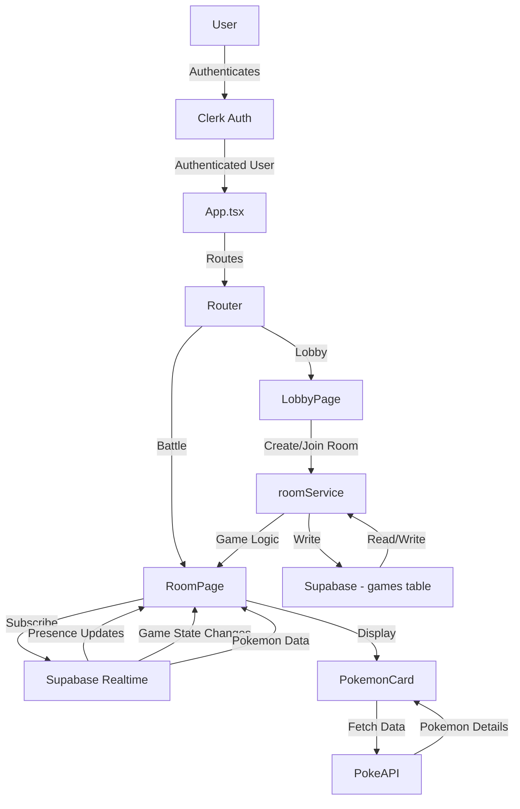

# Pokemon Battle Arena - AI Agent Documentation

## 📋 Application Purpose

**Pokemon Battle Arena** is a real-time multiplayer Pokemon battle game that enables players to compete against each other in turn-based combat. The application provides:

- **User Authentication**: Secure sign-in/sign-up via Clerk
- **Lobby System**: Create or join battle rooms using unique room codes
- **Real-time Gameplay**: Live updates using Supabase real-time channels
- **Pokemon Selection**: Random Pokemon assignment (Gen 1 - 151 Pokemon)
- **Turn-based Combat**: Strategic move selection and HP management
- **User Presence**: Track connected players in real-time
- **Battle Statistics**: HP bars, move displays, and battle logs

## 🛠️ Technology Stack

### **Frontend Framework**

- **React 19.1.1** - UI library with latest features
- **TypeScript 5.8.3** - Type-safe development
- **Vite 7.1.7** - Fast build tool and dev server
- **React Router 7.9.3** - Client-side routing

### **Styling & UI**

- **TailwindCSS 4.1.13** - Utility-first CSS framework
- **shadcn/ui** - Accessible component library (Radix UI primitives)
- **Lucide React** - Icon library
- **Motion (Framer Motion)** - Animation library
- **GSAP** - Advanced animations
- **OGL** - WebGL graphics library

### **State Management**

- **Zustand 5.0.8** - Lightweight state management
- **Jotai 2.15.0** - Atomic state management
- **TanStack React Query 5.81.5** - Server state management
- **Immer 10.1.3** - Immutable state updates

### **Backend & Database**

- **Supabase** - PostgreSQL database with real-time capabilities
  - Real-time channels for presence and updates
  - PostgreSQL tables: `users`, `games`, `pokemon_data`
  - Database triggers and subscriptions

### **Authentication**

- **Clerk 5.49.0** - User authentication and management

### **Data Management**

- **TanStack React Table 8.21.3** - Table component
- **TanStack React Virtual 3.13.12** - Virtual scrolling
- **@dnd-kit/core** - Drag and drop functionality

### **Testing**

- **Vitest 3.2.0** - Unit testing framework
- **React Testing Library 16.3.0** - Component testing
- **MSW 2.11.3** - API mocking
- **JSDOM 27.0.0** - DOM environment

### **Development Tools**

- **ESLint 9.36.0** - Code linting
- **Prettier 3.6.1** - Code formatting
- **Husky 9.1.7** - Git hooks
- **lint-staged** - Pre-commit linting
- **Volta** - Node version management (Node 22.17.0)

## 🏗️ High-Level Architecture

### **Directory Structure**

```
src/
├── components/           # Reusable UI components
│   ├── ui/              # shadcn/ui components
│   ├── Layout/          # Layout components
│   ├── Navbar.tsx       # Navigation
│   ├── Galaxy.tsx       # Visual effects
│   └── ...
├── features/            # Feature modules
│   └── pokemon/         # Pokemon battle feature
│       ├── components/  # Pokemon-specific components
│       ├── hooks/       # Custom hooks
│       ├── services/    # Pokemon API services
│       └── types/       # TypeScript types
├── pages/               # Route pages
│   ├── Index/           # Landing page
│   ├── LobbyPage.tsx    # Room creation/joining
│   ├── RoomPage.tsx     # Battle room
│   ├── pokemonPage.tsx  # Pokemon display
│   └── pokeTable.tsx    # Pokemon table view
├── services/            # Shared services
│   └── roomService.ts   # Room/game management
├── lib/                 # Utilities and configs
│   └── supabase.ts      # Supabase client
├── contexts/            # React contexts
│   └── ThemeContext     # Dark/light theme
├── providers/           # Provider wrappers
├── store/               # Zustand stores
├── hooks/               # Shared hooks
├── utils/               # Helper functions
└── router.tsx           # Route definitions
```

### **Data Flow Architecture**



### **Key Architectural Patterns**

1. **Feature-Based Organization**: Pokemon functionality isolated in `features/pokemon/`
2. **Service Layer**: Business logic separated into service files (`roomService`, etc.)
3. **Custom Hooks**: Reusable logic encapsulated (e.g., `usePokemonCard`)
4. **Component Composition**: Small, focused components combined for complex UIs
5. **Real-time Subscriptions**: Supabase channels for live updates
6. **Type Safety**: TypeScript interfaces for database schemas and API responses

### **Database Schema**

**users table**:

- `id` (string, PK) - User identifier
- `name`, `email` - User details
- `wins`, `losses` - Battle statistics
- `created_at` - Timestamp

**games table**:

- `id` (string, PK) - Game identifier
- `code` (string) - Room code
- `status` - 'waiting' | 'in_progress' | 'finished'
- `player1_user_id`, `player2_user_id` - Player references
- `player1_pokemon_id`, `player2_pokemon_id` - Pokemon IDs
- `player1_hp`, `player2_hp` - Current HP
- `player1_moves`, `player2_moves` - Selected moves (JSONB)
- `player1_ready`, `player2_ready` - Ready status
- `current_turn` - Turn tracker
- `game_log` - Battle history (JSONB)
- `winner_user_id` - Winner reference

**pokemon_data table**:

- `id` (PK) - Data identifier
- `room_code` - Room reference
- `user_id` - Player reference
- `pokemon_id` - Pokemon ID (1-151)

## 🤖 Agent Ruleset

When working on this codebase, AI agents MUST follow these guidelines:

### **Code Style & Conventions**

1. **TypeScript First**: Always use TypeScript with proper type definitions
2. **Functional Components**: Use React functional components with hooks
3. **Path Aliases**: Use `@/` alias for imports (e.g., `@/components/ui/button`)
4. **Component Naming**: PascalCase for components, camelCase for hooks/utils
5. **File Organization**: Keep related code in feature folders

### **Component Guidelines**

1. **shadcn/ui Components**: Prefer using existing shadcn/ui components from `components/ui/`
2. **Component Props**: Define explicit TypeScript interfaces for props
3. **Component Size**: Keep components focused and under 200 lines
4. **Export Style**: Use default exports for pages/components, named exports for utilities

### **State Management**

1. **Server State**: Use React Query for API data and caching
2. **Client State**: Use Zustand for global state, useState for local state
3. **Real-time**: Use Supabase channels for real-time subscriptions
4. **Immutability**: Use Immer for complex state updates

### **Supabase Integration**

1. **Client Instance**: Always import from `@/lib/supabase`
2. **Error Handling**: Always check for `error` in Supabase responses
3. **Real-time Cleanup**: Unsubscribe from channels in useEffect cleanup
4. **Type Safety**: Use the `Database` type from `lib/supabase.ts`

### **Styling Rules**

1. **TailwindCSS**: Use Tailwind utility classes (already configured with v4)
2. **Dark Mode**: Support dark mode using Tailwind's `dark:` prefix
3. **Responsive**: Use responsive prefixes (`sm:`, `md:`, `lg:`)
4. **Custom Styles**: Only use CSS modules for complex animations

### **Testing Requirements**

1. **Unit Tests**: Write tests for utilities and hooks
2. **Component Tests**: Use React Testing Library for component tests
3. **Mock APIs**: Use MSW for API mocking in tests
4. **Test Location**: Place tests in `__tests__` folders or `.test.tsx` files

### **Performance Best Practices**

1. **Code Splitting**: Use React Router's lazy loading for routes
2. **Query Optimization**: Set appropriate staleTime/gcTime in React Query
3. **Memoization**: Use useMemo/useCallback for expensive computations
4. **Virtual Scrolling**: Use TanStack Virtual for large lists

### **Security & Environment**

1. **Environment Variables**: Use `VITE_` prefix for client-side env vars
2. **API Keys**: Never commit API keys; use `.env` files
3. **Authentication**: Always check `isSignedIn` from Clerk before protected actions
4. **Input Validation**: Validate and sanitize user inputs

### **Git & Development Workflow**

1. **Commits**: Write clear, descriptive commit messages
2. **Linting**: Code must pass ESLint checks (`pnpm lint`)
3. **Formatting**: Use Prettier for consistent formatting (`pnpm prettier`)
4. **Type Checking**: Ensure TypeScript compiles (`pnpm typecheck`)
5. **Pre-commit**: Husky runs lint-staged automatically

### **Common Commands**

```bash
pnpm dev           # Start dev server (port 3000)
pnpm build         # Production build
pnpm test          # Run tests once
pnpm test:watch    # Run tests in watch mode
pnpm lint:fix      # Auto-fix linting issues
pnpm validate      # Run all checks (test, lint, build, typecheck)
```

## 💡 Suggested Improvements

### **High Priority**

1. **Error Boundaries**
   - Add more granular error boundaries for feature modules
   - Implement error reporting service (e.g., Sentry)
   - Create user-friendly error pages

2. **Loading States**
   - Add skeleton loaders for Pokemon cards
   - Implement suspense boundaries for code-split routes
   - Show loading indicators for Supabase operations

3. **Battle System Enhancements**
   - Implement move effectiveness calculations (type advantages)
   - Add attack animations and visual feedback
   - Display move details (power, accuracy, PP)
   - Implement status effects (burn, poison, paralysis)

4. **User Experience**
   - Add confirmation dialogs for leaving rooms
   - Implement reconnection logic for dropped connections
   - Show "opponent is typing" indicators
   - Add sound effects and background music

5. **Data Validation**
   - Add Zod schemas for form validation
   - Validate room codes format
   - Implement rate limiting for room creation

### **Medium Priority**

6. **Multiplayer Features**
   - Implement spectator mode for ongoing battles
   - Add friend system and private rooms
   - Create matchmaking system
   - Implement chat functionality in rooms

7. **Pokemon Features**
   - Allow Pokemon selection instead of random assignment
   - Implement Pokemon teams (6 Pokemon)
   - Add Pokemon abilities and held items
   - Cache Pokemon data locally (IndexedDB/localStorage)

8. **Analytics & Monitoring**
   - Track battle statistics (win/loss ratios)
   - Implement user leaderboards
   - Add battle history/replay system
   - Monitor real-time connection quality

9. **Testing Coverage**
   - Increase test coverage to >80%
   - Add E2E tests with Playwright or Cypress
   - Test real-time functionality with mock Supabase
   - Add visual regression testing

10. **Performance Optimization**
    - Implement Pokemon sprite preloading
    - Optimize bundle size (analyze with vite-bundle-visualizer)
    - Add service worker for offline support
    - Implement request caching strategy

### **Low Priority**

11. **Accessibility**
    - Add ARIA labels to interactive elements
    - Implement keyboard navigation for battles
    - Add screen reader announcements for game events
    - Ensure WCAG 2.1 AA compliance

12. **Internationalization**
    - Add i18n support (react-i18next)
    - Support multiple languages
    - Localize Pokemon names

13. **Mobile Optimization**
    - Improve touch interactions
    - Optimize layouts for mobile screens
    - Add PWA manifest and icons
    - Implement mobile-specific gestures

14. **Admin Features**
    - Create admin dashboard
    - Monitor active games
    - Manage user reports
    - View system analytics

15. **Code Quality**
    - Add JSDoc comments to complex functions
    - Create Storybook for component documentation
    - Implement stricter TypeScript rules
    - Refactor large components into smaller units

### **Technical Debt**

- **Unused imports**: Remove `import { error } from 'console'` in `router.tsx`
- **Type safety**: Add proper types instead of `any` in `RoomPage.tsx`
- **Service organization**: Consider moving `roomService.ts` into a feature folder
- **Dependency audit**: Review and update dependencies regularly
- **Environment setup**: Create `.env.example` with all required variables

### **Security Enhancements**

- Implement row-level security (RLS) policies in Supabase
- Add CSRF protection for sensitive operations
- Implement request rate limiting
- Add input sanitization for room codes and user inputs
- Set up security headers in hosting configuration

---

**Last Updated**: 2026-02-05  
**Version**: 0.0.1  
**Maintainers**: Development Team
